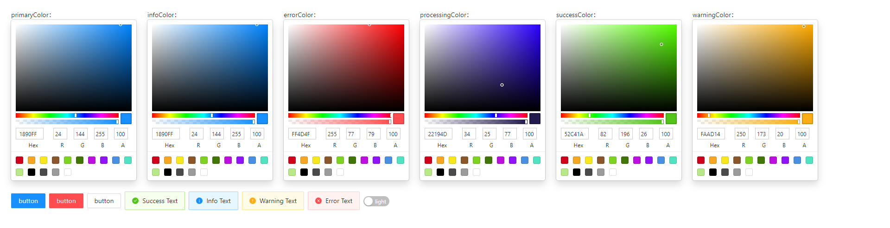
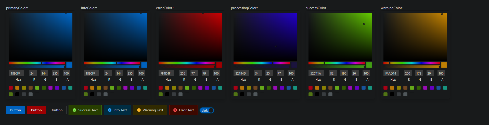

# Ant Design Dynamic Theme & Dark Mode

DEMO: https://antd-dynamic-theme-dark-mode.vercel.app/

EN: This project help you to use antd dynamic theme and dark/light mode

CN: 该项目能帮助你实现antd的主题切换和亮暗模式的切换

## Start Scripts

```
npm install
npm start
```

## How to achieve

* Dynamic Theme
    
    EN: This project use antd `ConfigProvider` to change the theme color, you can choose the color by color picker and direct apply to the `ConfigProvider`

    CN: 该项目使用antd的`ConfigProvider`来实现主题色的切换，你可以直接用取色盘直接吸取颜色并直接应用

* Dark/Light Mode

    EN: I use the [darkreader](https://www.npmjs.com/package/darkreader) to achieve dark/light mode, it's convenient

    CN: 使用了[darkreader](https://www.npmjs.com/package/darkreader)来实现亮暗模式的切换，它非常的方便

## Screenshots




